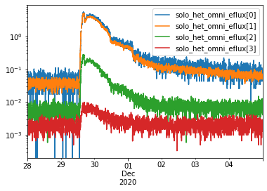
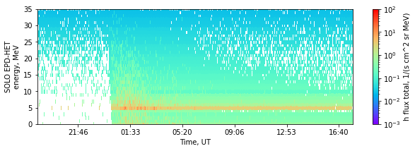

# Solar Orbiter Jupyter notebooks

Collection of Jupyter notebooks manipulating data from the Solar Orbiter mission. Data retrieval from `AMDA` using `speasy`.

## EPD/HET instrument
`solo_epd.ipynb` : Plotting Solar Orbiter EPD/HET electron and proton flux data.

